# Proyecto Lattix: Guerra Cognitiva, OSINT y la Gramática de lo Pensable

**Análisis del conflicto Irán 2026 desde la historia intelectual, la filosofía política y el análisis de inteligencia**

---

## Qué es este repositorio

Este repositorio no es un agregador de mapas ni un dashboard de seguimiento bélico. Otros proyectos ya cumplen esa función. La contribución de Lattix es **transversal**: cruza historia intelectual, filosofía política y análisis de inteligencia para examinar cómo la guerra de Irán 2026 está transformando la gramática de lo pensable en el orden internacional.

El enfoque se articula sobre tres ejes:

1. **La erosión simultánea de tres pilares del orden de posguerra**: el tabú nuclear, el sistema petrodólar y la capacidad colectiva de distinguir realidad de interfaz.
2. **La paradoja de Kahn**: la democratización de herramientas de visualización de inteligencia no democratiza la inteligencia — democratiza la *ilusión* de inteligencia.
3. **La gamificación de la percepción estratégica**: la guerra deja de percibirse como acontecimiento y empieza a consumirse como sistema interactivo.

## Estructura del repositorio

```mermaid
graph TD
    ROOT["Proyecto Lattix"] --> META["METODOLOGIA.md<br/>Marco intelectual y honestidad epistémica"]
    ROOT --> VIS["visuales/<br/>Elementos visuales para el paper"]
    ROOT --> TAX["taxonomia/<br/>Indicadores cognitivos de transición"]
    
    VIS --> V1["01 Mapa conceptual maestro"]
    VIS --> V2["02 Paradoja de Kahn"]
    VIS --> V3["03 Tres frentes de erosión"]
    VIS --> V4["04 Tríptico corresponsal→dashboard"]
    VIS --> V5["05 Gamificación de la guerra"]
    VIS --> V6["06 SIGINT vs OSINT"]
    VIS --> V7["07 Pipeline de espectacularización"]
    VIS --> V8["08 Línea temporal cognitiva"]
    VIS --> V9["09 Matrices comparativas"]
    
    TAX --> T1["Nivel 1: Indicadores semánticos"]
    TAX --> T2["Nivel 2: Indicadores institucional-discursivos"]
    TAX --> T3["Nivel 3: Indicadores de interfaz"]
    TAX --> TM["Matriz comparativa:<br/>Entreguerras vs Irán 2026"]
    TAX --> TG["Glosario bilingüe"]
```

## Navegación rápida

### Elementos visuales (`visuales/`)

| Archivo | Contenido |
|---------|-----------|
| [01-mapa-conceptual-lattix.md](visuales/01-mapa-conceptual-lattix.md) | Mapa maestro del marco analítico |
| [02-paradoja-kahn.md](visuales/02-paradoja-kahn.md) | Democratización de herramientas ≠ democratización de inteligencia |
| [03-tres-frentes-erosion.md](visuales/03-tres-frentes-erosion.md) | Erosión nuclear + financiera + cognitiva |
| [04-triptico-corresponsal.md](visuales/04-triptico-corresponsal.md) | Del corresponsal al dashboard, del testigo al usuario |
| [05-gamificacion-guerra.md](visuales/05-gamificacion-guerra.md) | La guerra como sistema interactivo + caso Fabian/Polymarket |
| [06-sigint-vs-osint.md](visuales/06-sigint-vs-osint.md) | Honestidad epistémica: qué es y qué no es inteligencia |
| [07-espectacularizacion.md](visuales/07-espectacularizacion.md) | De la operación militar al clip viral |
| [08-linea-temporal.md](visuales/08-linea-temporal.md) | Cronología curada de inflexiones cognitivas |
| [09-matrices-comparativas.md](visuales/09-matrices-comparativas.md) | Tablas comparativas estructuradas |

### Taxonomía de indicadores cognitivos (`taxonomia/`)

| Archivo | Contenido |
|---------|-----------|
| [README.md](taxonomia/README.md) | Marco metodológico de la taxonomía |
| [nivel-1-semanticos.md](taxonomia/nivel-1-semanticos.md) | Indicadores semánticos (cambios en el lenguaje) |
| [nivel-2-institucional-discursivos.md](taxonomia/nivel-2-institucional-discursivos.md) | Indicadores institucional-discursivos |
| [nivel-3-interfaz-visualizacion.md](taxonomia/nivel-3-interfaz-visualizacion.md) | Indicadores de interfaz y visualización |
| [matriz-comparativa.md](taxonomia/matriz-comparativa.md) | Entreguerras europea vs Irán 2026 |
| [glosario.md](taxonomia/glosario.md) | Glosario bilingüe de términos clave |
| [protocolo-de-aplicacion.md](taxonomia/protocolo-de-aplicacion.md) | Cómo aplicar los indicadores a un corpus |

### Documentos transversales

| Archivo | Contenido |
|---------|-----------|
| [METODOLOGIA.md](METODOLOGIA.md) | Marco intelectual, niveles de evidencia, honestidad SIGINT/OSINT |
| [LIMITES.md](LIMITES.md) | Lo que los indicadores no hacen: ni profecía, ni diagnóstico, ni prescripción |

## Metodología

Ver [METODOLOGIA.md](METODOLOGIA.md) para el marco completo. Puntos clave:

- **Formación de la autora**: historiadora con formación filosófica y máster en análisis de inteligencia.
- **Uso de LLMs**: los modelos de lenguaje son herramientas metodológicas de este proyecto, utilizados para estructurar, sintetizar y visualizar — no como fuentes de autoridad.
- **Honestidad epistémica**: consumir herramientas OSINT no equivale a hacer análisis SIGINT. Este proyecto opera dentro de sus límites metodológicos.

## Contexto del proyecto

Este repositorio forma parte del trabajo de investigación de [The Lattix Project](https://the-latix-project.org/), cuyo working paper *"Cuando lo impensable se vuelve discutible: IA, tabú nuclear y el fin de un orden mundial"* analiza la convergencia entre inteligencia artificial, erosión de tabúes estratégicos y transición de orden internacional.

---

*Proyecto Lattix — Historia intelectual, análisis estratégico y guerra cognitiva*
