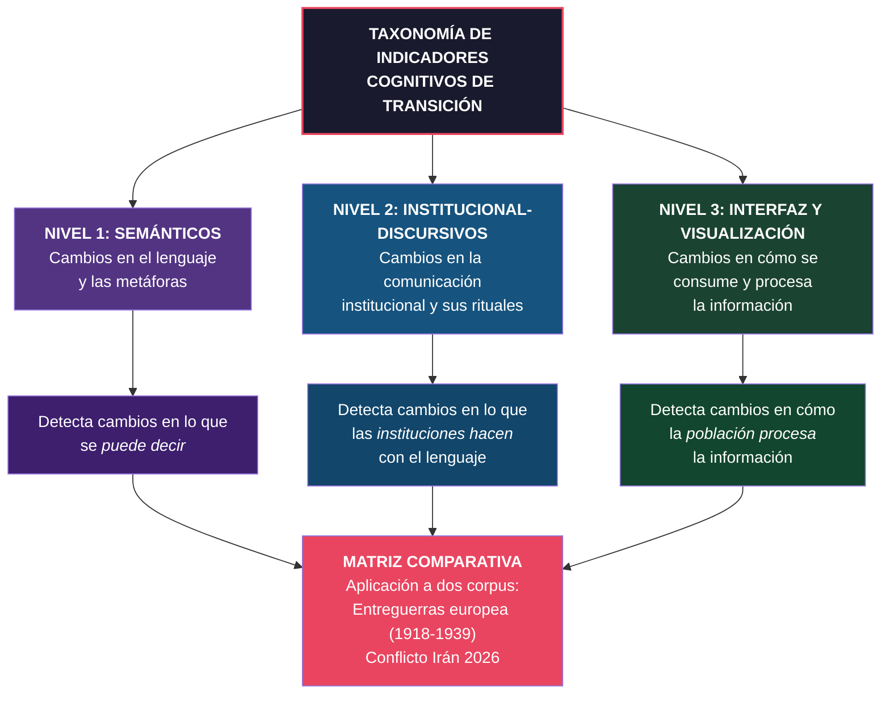

# Taxonomía de Indicadores Cognitivos Tempranos de Transición de Orden Internacional

## Qué es esta taxonomía

Un marco operativo para detectar **cuándo cambia la gramática de lo pensable antes de que cambie formalmente el sistema**. No mide eventos: mide desplazamientos en lo que una sociedad considera posible, aceptable o discutible.

## Para qué sirve

- **Historia intelectual**: identificar puntos de inflexión cognitivos en corpus históricos.
- **Análisis estratégico**: detectar señales tempranas de transición de orden antes de que se manifiesten en eventos.
- **OSINT avanzado**: ir más allá del dato bruto para analizar transformaciones en la estructura de la percepción.

## Principio rector

> Los cambios de orden internacional no empiezan con tratados ni con guerras. Empiezan cuando cambia lo que una sociedad puede pensar, decir y debatir sin que el sistema lo expulse como inviable.

## Estructura de tres niveles

## Cómo leer cada indicador

Cada indicador sigue una plantilla uniforme (decisión metodológica, no estilística):

| Campo | Qué contiene |
|-------|-------------|
| **Nombre corto** | Etiqueta operativa del indicador |
| **Definición precisa** | Qué mide exactamente, sin ambigüedad |
| **Mecanismo cognitivo que detecta** | Qué desplazamiento mental señala |
| **Marcadores lingüísticos/discursivos observables** | Qué buscar en un corpus textual o mediático |
| **Ejemplos históricos posibles** | Al menos 2 de períodos distintos |
| **Riesgos de falso positivo** | Cuándo el indicador puede activarse sin que haya transición real |
| **Utilidad metodológica** | Para qué sirve en historia intelectual, geopolítica y OSINT |

## Navegación

| Documento | Contenido |
|-----------|-----------|
| [nivel-1-semanticos.md](nivel-1-semanticos.md) | 5 indicadores semánticos |
| [nivel-2-institucional-discursivos.md](nivel-2-institucional-discursivos.md) | 5 indicadores institucional-discursivos |
| [nivel-3-interfaz-visualizacion.md](nivel-3-interfaz-visualizacion.md) | 5 indicadores de interfaz y visualización |
| [matriz-comparativa.md](matriz-comparativa.md) | Aplicación comparativa: entreguerras vs Irán 2026 |
| [glosario.md](glosario.md) | Glosario bilingüe de términos clave |

## Nota metodológica

Estos indicadores son **originales de este proyecto**. No son categorías estándar de ciencia política ni de relaciones internacionales. Están diseñados para captar lo que las taxonomías convencionales no captan: **los cambios previos al cambio**, las señales de que la estructura de lo pensable se está desplazando antes de que el sistema formal lo registre.

---

*Taxonomía desarrollada por el Proyecto Lattix como herramienta analítica para historia intelectual y análisis estratégico.*
