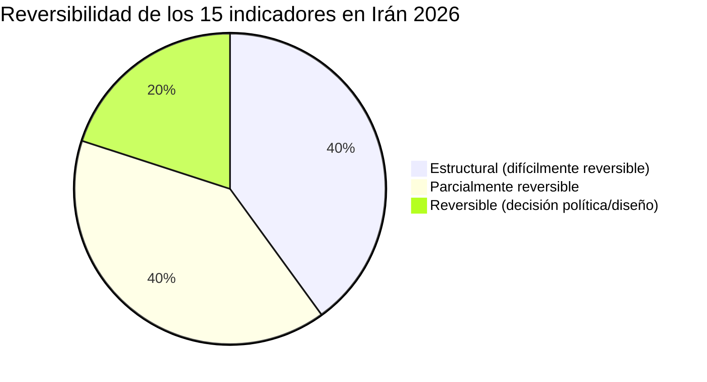
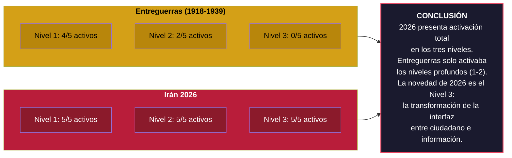

# Matriz Comparativa: Entreguerras Europea (1918-1939) vs Conflicto Irán 2026

## Propósito

Esta matriz aplica los 15 indicadores cognitivos a dos corpus históricos para responder una pregunta específica: **¿estamos ante una transición de orden internacional comparable a la del período de entreguerras?** La comparación no busca equivalencias directas — busca patrones estructurales: qué tipo de desplazamientos cognitivos preceden a los cambios de orden.

## Cómo leer la matriz

- **Presencia**: ¿se detecta el indicador en el corpus? (Sí / Parcial / No)
- **Intensidad**: Alta / Media / Baja — grado de activación del indicador.
- **Reversibilidad**: ¿El desplazamiento detectado es reversible, parcialmente reversible o estructural? Esta columna es crítica: no es lo mismo una anomalía mediática pasajera que una mutación del lenguaje estratégico o una erosión del tabú nuclear. (Sugerencia de Lumen incorporada.)
- **Evidencia**: Ejemplo concreto observable en el corpus.

---

## Nivel 1: Indicadores Semánticos

| Indicador | Entreguerras (1918-1939) | | | | Irán 2026 | | | | Reversibilidad |
|-----------|:-:|:-:|:-:|:-:|:-:|:-:|:-:|:-:|:-:|
| | **Presencia** | **Intensidad** | **Evidencia** | | **Presencia** | **Intensidad** | **Evidencia** | | |
| **1.1 Desplazamiento metafórico nuclear** | Parcial | Media | El gas (arma de WWI) pasa de horror a "arma táctica" en doctrina militar de entreguerras. Precedente estructural del desplazamiento nuclear posterior. | | Sí | Alta | Discusión pública de bunker busters nucleares tácticos como "opción calculable". Desaparición de Hiroshima como referencia moral en debates públicos. | | **Estructural** — Una vez que el tabú se erosiona discursivamente, la reconstrucción es extremadamente difícil. |
| **1.2 Inversión de carga probatoria** | Sí | Alta | Rearme alemán justificado por "amenazas potenciales". Carga de la prueba sobre quienes pedían moderación (apaciguamiento como posición defensiva). | | Sí | Alta | Ataques justificados por capacidades nucleares iraníes como amenaza inminente. Quien pide esperar a evidencia definitiva carga con la prueba. | | **Parcialmente reversible** — Depende de marcos institucionales que pueden restaurar estándares de evidencia. |
| **1.3 Colapso de la distancia irónica** | Sí | Media | Cultura de Weimar: ironía como distancia crítica (Brecht, Grosz). Coexiste con normalización directa del militarismo. Ambas tendencias presentes simultáneamente. | | Sí | Alta | Memes sobre espacio aéreo iraní "limpio" tras bombardeos. La ironía no funciona como crítica sino como participación lúdica. | | **Parcialmente reversible** — Requiere cambio cultural profundo, pero la distancia irónica se ha restaurado históricamente tras periodos de trauma colectivo. |
| **1.4 Migración léxica entre dominios** | Sí | Alta | Reparaciones de Versalles: la guerra se calcula en marcos alemanes. Deuda de guerra como categoría financiera dominante. El lenguaje financiero coloniza la experiencia bélica. | | Sí | Alta | Polymarket opera literalmente en la intersección: apuestas financieras sobre eventos bélicos. "ROI militar", "eficiencia de bombardeos". | | **Estructural** — La fusión de vocabularios refleja una fusión de lógicas que se auto-refuerza. |
| **1.5 Erosión del subjuntivo** | Sí | Alta | Verano 1914: paso de "si Austria actúa" a "cuando empiece la movilización". 1938-39: de "si podemos evitar" a "cuando Alemania ataque". | | Sí | Alta | "Cuando Irán tenga capacidad nuclear" sustituye a "si Irán desarrollara". Preparación como marco dominante sobre prevención. | | **Parcialmente reversible** — El subjuntivo puede restaurarse si las condiciones políticas cambian, pero la erosión discursiva deja residuo normativo. |

---

## Nivel 2: Indicadores Institucional-Discursivos

| Indicador | Entreguerras (1918-1939) | | | | Irán 2026 | | | | Reversibilidad |
|-----------|:-:|:-:|:-:|:-:|:-:|:-:|:-:|:-:|:-:|
| | **Presencia** | **Intensidad** | **Evidencia** | | **Presencia** | **Intensidad** | **Evidencia** | | |
| **2.1 Aceleración del ciclo declarativo** | No | Baja | El ciclo diplomático de entreguerras era lento (semanas/meses). La deliberación institucional mantenía su temporalidad. | | Sí | Alta | Casa Blanca comunica operación militar mediante vídeo viral en X en minutos. Ciclo declarativo comprimido a la velocidad algorítmica. | | **Reversible** — Decisión institucional que puede revertirse si hay voluntad política de recuperar protocolos deliberativos. |
| **2.2 Hibridación del registro oficial** | Parcial | Media | Propaganda nazi usaba estética cinematográfica (Riefenstahl). Propaganda soviética fusionaba arte y Estado (Eisenstein). Pero se producía en canales claramente estatales. | | Sí | Alta | "Justice the American Way": Hollywood + imágenes reales + "Flawless Victory". Publicado en X, indistinguible de contenido de entretenimiento en el feed. | | **Parcialmente reversible** — La hibridación depende de decisiones comunicativas, pero una vez normalizada, revertirla requiere esfuerzo activo. |
| **2.3 Desacoplamiento ritual/función** | Sí | Alta | Sociedad de Naciones: sesiones, resoluciones y declaraciones continúan mientras Japón invade Manchuria (1931), Italia invade Abisinia (1935), Alemania remilitariza Renania (1936). El ritual persiste; la función ha desaparecido. | | Sí | Alta | Consejo de Seguridad emite declaraciones formulaicas mientras operación militar avanza sin mandato internacional. "Profunda preocupación" como techo de respuesta. | | **Estructural** — Una vez que el ritual se desacopla de la función, restaurar la credibilidad institucional requiere reconstrucción, no reparación. |
| **2.4 Monetización del juicio anticipatorio** | Parcial | Baja | Mercados financieros reaccionaban a noticias bélicas (bolsa, commodities). Pero la anticipación no se monetizaba públicamente como apuesta sobre eventos específicos. | | Sí | Alta | Polymarket/Kalshi: apuestas públicas sobre ataques, alto el fuego, liderazgo iraní. Caso Fabian: apostadores amenazan a periodista para alterar cobertura. | | **Parcialmente reversible** — Depende de regulación financiera, pero la infraestructura tecnológica ya está establecida. |
| **2.5 Inversión de cadena de custodia** | No | Baja | La cadena corresponsal → editor → medio → público se mantuvo intacta durante todo el período. No había canales alternativos de distribución masiva. | | Sí | Alta | Dashboard como fuente primaria consultada antes que cualquier medio. Medios operan como verificadores secundarios que llegan después del dato crudo. | | **Estructural** — La inversión refleja un cambio en la infraestructura informativa que no puede deshacerse sin desmantelar las plataformas. |

---

## Nivel 3: Indicadores de Interfaz y Visualización

| Indicador | Entreguerras (1918-1939) | | | | Irán 2026 | | | | Reversibilidad |
|-----------|:-:|:-:|:-:|:-:|:-:|:-:|:-:|:-:|:-:|
| | **Presencia** | **Intensidad** | **Evidencia** | | **Presencia** | **Intensidad** | **Evidencia** | | |
| **3.1 Paradoja de Kahn cuantificada** | No | Ausente | No existían herramientas de visualización de inteligencia accesibles al público. La asimetría entre saber del ciudadano y saber del Estado era reconocida. | | Sí | Alta | Millones de usuarios con FlightRadar24, Liveuamap, FIRMS. Sobreconfianza epistémica masiva. La brecha herramienta-competencia es máxima; la conciencia de esa brecha, mínima. | | **Estructural** — El acceso a herramientas no va a reducirse. Solo la educación analítica podría cerrar la brecha, y no hay mecanismo para ello a escala. |
| **3.2 Compresión atención-interpretación** | No | Ausente | El ciclo informativo era de días/semanas. La prensa imponía una temporalidad que permitía reflexión. | | Sí | Alta | Segundos entre dato y "análisis". El reflejo sustituye a la interpretación. Las correcciones posteriores no alcanzan la difusión del dato original. | | **Estructural** — Función de la velocidad de las redes, que no va a reducirse. |
| **3.3 Estética lúdica del dato bélico** | No | Ausente | No existían visualizaciones interactivas de datos bélicos. Los mapas de periódicos eran estáticos y austeros. | | Sí | Alta | Paneles con estética de *Command & Conquer*. Contadores de impactos, leaderboards, códigos de color competitivos. "Flawless Victory" como cierre oficial. | | **Parcialmente reversible** — Decisiones de diseño que podrían cambiar, pero la expectativa estética del usuario ya está formada. |
| **3.4 Desaparición del metadato epistémico** | Parcial | Baja | Mapas de prensa omitían incertidumbre, pero el medio (papel) sugería aproximación. Propaganda omitía fuentes, pero en canales identificables como propaganda. | | Sí | Alta | Paneles que presentan datos de satélite, rumores de Telegram e inferencias algorítmicas con idéntico formato visual. Sin indicadores de confianza ni procedencia. | | **Reversible** — Decisión de diseño que puede corregirse. Los paneles podrían incluir metadato epistémico si hubiera voluntad o regulación. |
| **3.5 Convergencia interfaz-realidad** | No | Ausente | Ninguna herramienta de consumo civil se parecía a una herramienta militar. La distancia entre civil y operador era total y reconocida. | | Sí | Alta | "Cualquier móvil se convierte en una sala de operaciones del Pentágono." La interfaz del espectador replica la del operador. | | **Estructural** — La convergencia tecnológica no es reversible. La distinción depende ahora de la educación, no de la tecnología. |

---

## Análisis sintético

### Indicadores presentes en ambos corpus (estructurales de transición de orden)

Cinco indicadores se activan en ambos períodos:

| Indicador | Implicación |
|-----------|-------------|
| 1.1 Desplazamiento metafórico | La desacralización de armas consideradas tabú precede a cambios de orden en ambos casos |
| 1.2 Inversión de carga probatoria | La flexibilización de estándares de evidencia para la acción militar es recurrente |
| 1.4 Migración léxica | La fusión de lógicas militar-financiera señala erosión de fronteras normativas |
| 1.5 Erosión del subjuntivo | El paso de la contingencia a la inevitabilidad discursiva precede a las guerras |
| 2.3 Desacoplamiento ritual/función | Las instituciones internacionales siguen funcionando formalmente cuando ya han dejado de funcionar realmente |

**Conclusión**: estos cinco indicadores parecen ser **marcadores estructurales de transición de orden**, no específicos de un período. Si se confirman en otros corpus (pre-WWI, pre-WWII, pre-colapso soviético), podrían constituir una batería mínima de detección temprana.

### Indicadores únicos de 2026 (fenómenos genuinamente nuevos)

Cinco indicadores se activan solo en 2026 — todos de Nivel 3:

| Indicador | Por qué es nuevo |
|-----------|-----------------|
| 3.1 Paradoja de Kahn | No existían herramientas de visualización de inteligencia accesibles al público |
| 3.2 Compresión atención-interpretación | El ciclo informativo nunca se había comprimido a segundos |
| 3.3 Estética lúdica | No existían visualizaciones interactivas de datos bélicos |
| 3.5 Convergencia interfaz-realidad | Ninguna herramienta de consumo civil replicaba herramientas militares |
| 2.5 Inversión de cadena de custodia | No había canales alternativos de distribución masiva |

**Conclusión**: los indicadores de Nivel 3 son mayoritariamente **fenómenos sin precedente histórico exacto**. Esto no los invalida como indicadores — al contrario, los convierte en los más potentes para detectar lo genuinamente distinto de 2026. Pero requieren cautela metodológica: no pueden validarse por comparación histórica y deben evaluarse con criterios internos.

### Indicadores presentes en entreguerras pero ausentes o débiles en 2026

Ningún indicador de la taxonomía está presente en entreguerras y completamente ausente en 2026. Esto es significativo: **2026 presenta todos los indicadores de transición que se activaron en entreguerras, más un conjunto adicional de indicadores nuevos que no existían entonces**. El patrón sugiere una transición de mayor profundidad y complejidad.

### Mapa de reversibilidad

**Lectura**: 6 de los 15 indicadores señalan cambios estructurales difícilmente reversibles (tabú nuclear erosionado, cadenas informativas invertidas, herramientas democratizadas, ciclos comprimidos). Solo 3 son reversibles mediante decisión política o de diseño. Esto sugiere que incluso si el conflicto terminara mañana, muchos de los desplazamientos cognitivos detectados persistirían.

---

## Diagrama: patrón comparado de activación

---

*La comparación no demuestra que 2026 sea "igual" que 1939. Demuestra que los indicadores cognitivos de transición de orden están más activados ahora que entonces — y que la novedad de 2026 es un nivel entero de indicadores que no existía.*
