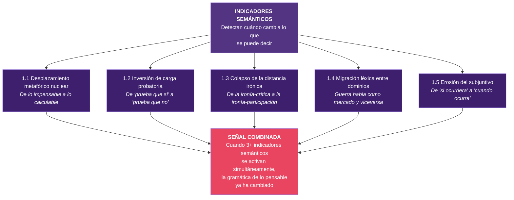

# Nivel 1: Indicadores Semánticos

Los indicadores semánticos detectan **cambios en el lenguaje** que preceden a los cambios formales en el sistema. Son los más profundos y los más difíciles de medir, pero también los más tempranos: cuando cambian las metáforas con las que una sociedad habla de la guerra, el orden o el poder, el sistema ya ha empezado a moverse.

---

## 1.1: Desplazamiento del campo metafórico nuclear

**Definición precisa:** Migración del lenguaje sobre armas nucleares desde el campo semántico de lo *impensable/sagrado/absoluto* hacia el campo de lo *calculable/táctico/gestionable*. El indicador se activa cuando el uso nuclear deja de discutirse como tabú moral y empieza a discutirse como opción estratégica con costes y beneficios cuantificables.

**Mecanismo cognitivo que detecta:** La desacralización del límite nuclear. Cuando una sociedad pasa de tratar el arma nuclear como excepción absoluta a tratarla como una variable más en un cálculo estratégico, la estructura de lo pensable ha cambiado antes de que cambie ninguna política formal.

**Marcadores lingüísticos/discursivos observables:**
- Sustitución de "impensable", "inimaginable", "línea roja absoluta" por "escenario", "opción", "contingencia", "uso táctico limitado".
- Aparición de marcos de análisis coste-beneficio aplicados al uso nuclear ("daño aceptable", "respuesta proporcional nuclear").
- Uso normalizado de expresiones como "arsenal nuclear táctico" frente a "arma de destrucción masiva".
- Desaparición progresiva de las referencias a Hiroshima/Nagasaki como marco moral de referencia.

**Ejemplos históricos posibles:**
- **Entreguerras / inicios de la Guerra Fría (1945-1955):** Transición desde el shock de Hiroshima hacia la doctrina de "represalia masiva" de Dulles, donde el uso nuclear se presentó como herramienta de política exterior calculable.
- **Debate sobre neutron bomb (1977-1978):** El arma de neutrones se presentó como "bomba limpia" — la metáfora de limpieza desplazó el campo semántico del horror al de la eficiencia.
- **Irán 2026:** Discusión pública del uso de bunker busters nucleares tácticos como "opción razonable" contra instalaciones subterráneas iraníes.

**Riesgos de falso positivo:**
- Retórica de disuasión calculada que no refleja un desplazamiento real del tabú, sino una estrategia comunicativa deliberada para presionar sin intención de uso.
- Discurso académico técnico sobre escalada que analiza escenarios sin normalizarlos (diferencia entre *pensar lo impensable* como ejercicio intelectual y *normalizarlo* como opción política).

**Utilidad metodológica:**
- *Historia intelectual:* Permite rastrear el momento exacto en que un tabú moral empieza a erosionarse en el discurso público, antes de que se produzca ningún cambio de política.
- *Geopolítica:* Señal temprana de que la arquitectura de disuasión está bajo presión, porque la disuasión depende de que ambas partes traten el uso nuclear como impensable.
- *Análisis OSINT:* Detectable mediante análisis de frecuencia léxica en declaraciones oficiales, editoriales, y discurso en redes sociales.

---

## 1.2: Inversión de la carga probatoria epistémica

**Definición precisa:** Transición en la estructura argumentativa pública desde "prueba que ocurrió" hacia "prueba que no ocurrió". El indicador se activa cuando la mera posibilidad de un evento se trata como suficiente para actuar, y la carga de demostrar que *no* ocurrirá recae sobre quien cuestiona la acción.

**Mecanismo cognitivo que detecta:** La sobrecarga informativa produce una inversión en los estándares de evidencia. Cuando hay demasiados datos sin verificar, el criterio por defecto pasa de la prudencia escéptica ("¿hay pruebas de que esto sea cierto?") a la prudencia defensiva ("¿puedes garantizar que no sea cierto?").

**Marcadores lingüísticos/discursivos observables:**
- Proliferación de "no podemos descartar que...", "no hay garantías de que no...", "la ausencia de prueba no es prueba de ausencia".
- Argumentaciones que exigen certeza negativa como condición para no actuar.
- Uso de imágenes satelitales o datos OSINT como "prueba" de intenciones, no solo de capacidades.
- Desplazamiento desde "intelligence-based" a "possibility-based" en justificaciones de acción militar.

**Ejemplos históricos posibles:**
- **Irak (2002-2003):** La doctrina de ataque preventivo de Bush convirtió la *posibilidad* de armas de destrucción masiva en justificación suficiente. La carga de la prueba se invirtió: Irak debía demostrar que *no* tenía armas.
- **Período de entreguerras (1930s):** La justificación del rearme alemán se basó en la *posibilidad* de amenazas externas, no en amenazas verificadas. La carga probatoria recayó sobre quienes pedían moderación.
- **Irán 2026:** Justificación de ataques basada en capacidades nucleares iraníes como amenaza inminente, donde la carga de la prueba recae sobre quien pide esperar a evidencia definitiva.

**Riesgos de falso positivo:**
- Debates legítimos sobre precaución ante amenazas difusas (terrorismo, pandemias) donde la inversión de carga probatoria puede ser racionalmente justificable.
- Confusión con el principio de precaución ambiental, que tiene una lógica distinta.

**Utilidad metodológica:**
- *Historia intelectual:* Permite detectar cuándo una sociedad abandona el escepticismo como posición por defecto — un cambio que históricamente precede a decisiones irreversibles.
- *Geopolítica:* Indicador de que el marco de justificación para la acción militar se ha flexibilizado peligrosamente.
- *Análisis OSINT:* Detectable en el análisis de declaraciones oficiales y editoriales: buscar la estructura argumentativa, no solo el contenido.

---

## 1.3: Colapso de la distancia irónica

**Definición precisa:** Desaparición de la distancia irónica como mecanismo de procesamiento de la violencia, sustituida por engagement directo y no reflexivo con el espectáculo bélico. El indicador se activa cuando la ironía deja de funcionar como mecanismo de protección cognitiva y se convierte en vehículo de normalización.

**Mecanismo cognitivo que detecta:** La ironía sirve históricamente como mecanismo de procesamiento de lo inaceptable: permite nombrar el horror sin internalizarlo como normalidad. Cuando la ironía sobre la guerra deja de ser distancia crítica y se convierte en *participación lúdica*, la función protectora ha colapsado.

**Marcadores lingüísticos/discursivos observables:**
- Memes sobre bombardeos y víctimas que no funcionan como crítica sino como entretenimiento.
- Uso de vocabulario de videojuegos ("kill streak", "headshot", "flawless victory") para describir operaciones militares reales sin intención satírica.
- Comentarios humorísticos sobre datos de guerra (espacio aéreo "limpio" tras bombardeos) que no provocan rechazo sino viralidad.
- Desaparición de la incomodidad como reacción al humor sobre violencia real.

**Ejemplos históricos posibles:**
- **Post-Vietnam (1970s-80s):** Películas como *Apocalypse Now* y *M.A.S.H.* usaban la ironía como herramienta crítica. La distancia irónica funcionaba como mecanismo de denuncia, no de normalización.
- **Post-11S (2001-2010):** La ironía sobre la "guerra contra el terror" era predominantemente crítica (Jon Stewart, *The Daily Show*). Aún funcionaba como distancia reflexiva.
- **Irán 2026:** Los memes sobre el espacio aéreo iraní vacío no son crítica: son entretenimiento. La ironía ha pasado de ser distancia a ser participación.

**Riesgos de falso positivo:**
- Confusión con humor negro tradicional, que siempre ha existido en contextos bélicos como mecanismo de supervivencia psicológica (humor de trinchera).
- Culturas con tradición satírica fuerte (Reino Unido, España) donde la ironía sobre el poder es endémica y no necesariamente señala colapso.

**Utilidad metodológica:**
- *Historia intelectual:* Permite distinguir épocas en las que la ironía funciona como resistencia (Weimar, posguerra) de épocas en las que funciona como normalización (2026).
- *Geopolítica:* Señal de que la resistencia cognitiva de la población a la violencia estatal se ha debilitado.
- *Análisis OSINT:* Detectable mediante análisis de sentimiento y tono en redes sociales, comparando la proporción de ironía crítica vs. ironía participativa.

---

## 1.4: Migración léxica entre dominios

**Definición precisa:** Colonización del lenguaje militar por terminología financiera (o viceversa), de modo que las categorías cognitivas de un dominio empiezan a estructurar el razonamiento sobre el otro. El indicador se activa cuando las fronteras conceptuales entre guerra y mercado se difuminan en el discurso público.

**Mecanismo cognitivo que detecta:** Las metáforas no son adornos: estructuran el pensamiento. Cuando una sociedad habla de la guerra en términos financieros ("coste de oportunidad de un bombardeo", "retorno de la inversión militar") o del mercado en términos bélicos ("guerra comercial", "arsenal financiero"), las fronteras cognitivas entre ambos dominios se disuelven.

**Marcadores lingüísticos/discursivos observables:**
- "Invertir" en una operación militar; "retorno" de un ataque; "coste" de la paz.
- "Mercado de la escalada"; guerra como "activo" o "commodity".
- Análisis bélicos que usan métricas financieras (ROI militar, "eficiencia" de bombardeos).
- Análisis financieros que usan gramática bélica (mercados "atacan" monedas, "defensa" de divisas).
- Polymarket y Kalshi operando literalmente en la intersección: apuestas financieras sobre eventos bélicos.

**Ejemplos históricos posibles:**
- **Entreguerras (1920s-30s):** La reparación de guerra como deuda financiera (Tratado de Versalles). La guerra pasó a calcularse en marcos alemanes, no en muertos. La migración léxica de lo bélico a lo financiero fue un síntoma de que el marco moral de la Gran Guerra ya se estaba erosionando.
- **Guerra del Golfo (1991):** Primera guerra presentada como "quirúrgica" y "eficiente" — vocabulario de gestión empresarial aplicado a operaciones militares.
- **Irán 2026:** Los mercados de predicción son la materialización literal de esta migración: el hecho bélico se convierte en activo apostable con precio de mercado.

**Riesgos de falso positivo:**
- Uso metafórico convencional que no implica confusión conceptual real ("guerra de precios", "batalla electoral").
- Análisis técnico legítimo de costes militares que no necesariamente implica reducción moral.

**Utilidad metodológica:**
- *Historia intelectual:* Permite detectar cuándo dos dominios conceptuales que deberían mantenerse separados empiezan a fusionarse en el discurso.
- *Geopolítica:* Señal de que la separación normativa entre guerra y comercio se está erosionando — algo que históricamente precede a conflictos donde los intereses económicos dominan sobre los límites morales.
- *Análisis OSINT:* Detectable mediante análisis de co-ocurrencia léxica en medios y redes: frecuencia con la que vocabulario financiero aparece en contextos militares y viceversa.

---

## 1.5: Erosión del subjuntivo geopolítico

**Definición precisa:** Transición gramatical en el discurso sobre conflictos desde el modo subjuntivo/condicional ("si X ocurriera", "en el caso de que") hacia el modo indicativo/futuro ("cuando X ocurra", "una vez que X pase"). El indicador se activa cuando la posibilidad se convierte en inevitabilidad discursiva.

**Mecanismo cognitivo que detecta:** El subjuntivo es el modo verbal de la contingencia: señala que algo es posible pero no necesario. El indicativo es el modo de la certeza. Cuando el discurso público pasa del subjuntivo al indicativo para hablar de eventos catastróficos (guerra nuclear, colapso financiero, ataque masivo), la sociedad ha dejado de tratar esos eventos como evitables y ha empezado a tratarlos como inevitables. Eso cambia radicalmente la estructura de la deliberación.

**Marcadores lingüísticos/discursivos observables:**
- Sustitución de "si hubiera un ataque nuclear" por "cuando se produzca un ataque nuclear".
- Desaparición del condicional en análisis estratégicos: "el conflicto escalará" en lugar de "el conflicto podría escalar".
- Uso de "prepararse para" en lugar de "prevenir" como marco dominante.
- Planes de contingencia presentados como inevitabilidades en lugar de como precauciones.

**Ejemplos históricos posibles:**
- **Europa, verano de 1914:** En las semanas previas a la Gran Guerra, el discurso diplomático pasó del condicional ("si Austria actúa...") al indicativo ("cuando empiece la movilización..."). La guerra dejó de ser evitable en el lenguaje antes de dejar de serlo en los hechos.
- **Europa, 1938-1939:** Tras Múnich, el discurso británico pasó del apaciguamiento ("si podemos evitar...") a la preparación ("cuando Alemania ataque..."). El subjuntivo se agotó antes que la paz formal.
- **Irán 2026:** La discusión pública sobre escalada nuclear pasó del subjuntivo ("si Irán desarrollara un arma nuclear") al indicativo ("cuando Irán tenga capacidad nuclear") meses antes de que cambiara la posición oficial.

**Riesgos de falso positivo:**
- Planificación estratégica legítima que usa indicativo por rigor analítico, no por fatalismo (los planes de contingencia siempre usan indicativo).
- Periodismo de investigación que anticipa escenarios como parte de su función informativa.
- Diferencias culturales y lingüísticas en el uso del subjuntivo (el inglés lo usa menos que el español, por ejemplo).

**Utilidad metodológica:**
- *Historia intelectual:* Indicador extraordinariamente temprano. El cambio de modo verbal en el discurso público precede a los cambios de política, a veces por meses o años.
- *Geopolítica:* Cuando una sociedad deja de usar el subjuntivo para hablar de catástrofes, ha dejado de creer que puede evitarlas. Eso reduce la presión política para la prevención.
- *Análisis OSINT:* Detectable mediante análisis gramatical automatizado de declaraciones oficiales y editoriales. El ratio subjuntivo/indicativo sobre temas de escalada es un indicador cuantificable.

---

## Síntesis del Nivel 1

