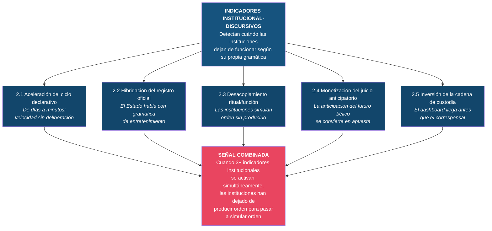

# Nivel 2: Indicadores Institucional-Discursivos

Los indicadores institucional-discursivos detectan **cambios en cómo las instituciones comunican, ritualizan y procesan el conflicto**. Operan en un nivel intermedio: más visibles que los semánticos, pero más estructurales que los de interfaz. Señalan el momento en que las instituciones dejan de funcionar según su propia gramática y empiezan a operar con la gramática de otro sistema.

---

## 2.1: Aceleración del ciclo declarativo

**Definición precisa:** Compresión progresiva del intervalo temporal entre un evento y la respuesta institucional oficial, pasando de días a horas a minutos, con el consiguiente sacrificio de la deliberación, la verificación y la matización. El indicador se activa cuando la velocidad de la respuesta institucional se vuelve incompatible con los procesos de deliberación que justifican su autoridad.

**Mecanismo cognitivo que detecta:** Las instituciones derivan su legitimidad, en parte, de la deliberación: consultan, verifican, calibran. Cuando la presión del ecosistema informativo obliga a responder en minutos, la forma institucional se mantiene pero la sustancia deliberativa desaparece. La institución emite a velocidad de red social pero con pretensión de autoridad institucional. Es una forma de vaciamiento funcional disfrazada de eficiencia.

**Marcadores lingüísticos/discursivos observables:**
- Comunicados oficiales publicados en redes sociales antes que en canales institucionales formales.
- Declaraciones que se corrigen, matizan o retractan horas después de su publicación.
- Desaparición de los "sin comentarios" o "estamos evaluando la situación" — la presión algorítmica penaliza el silencio.
- Ministros, portavoces o jefes de Estado respondiendo en tiempo real a eventos no verificados.
- Uso creciente de stories, hilos y formatos efímeros para comunicación institucional.

**Ejemplos históricos posibles:**
- **Crisis de los misiles de Cuba (1962):** Kennedy mantuvo 13 días de deliberación antes de responder públicamente. El ciclo declarativo era de días. La deliberación era constitutiva de la respuesta.
- **11-S (2001):** Bush tardó horas en hacer la primera declaración formal. El ciclo se comprimió a horas, pero aún permitía calibración.
- **Irán 2026:** La Casa Blanca publicó el vídeo "Justice the American Way" en X como pieza central de comunicación de una operación militar. El ciclo declarativo opera en minutos y con gramática de entretenimiento, no de deliberación.

**Riesgos de falso positivo:**
- Gestión de crisis legítima que requiere comunicación rápida (catástrofes naturales, ataques terroristas) donde la velocidad no implica vaciamiento deliberativo.
- Adaptación genuina de las instituciones a nuevos medios sin pérdida de sustancia (algunas instituciones comunican bien en redes sin sacrificar rigor).

**Utilidad metodológica:**
- *Historia intelectual:* Permite medir la compresión temporal de la deliberación institucional a lo largo de la historia, lo cual correlaciona con la calidad de las decisiones en momentos de crisis.
- *Geopolítica:* Indicador de que las instituciones están perdiendo autonomía frente a la lógica algorítmica — un tipo de soberanía erosionada que raramente se discute.
- *Análisis OSINT:* Detectable midiendo el intervalo temporal entre eventos y respuestas oficiales. Cuantificable a partir de timestamps en redes sociales y registros institucionales.

---

## 2.2: Hibridación del registro oficial

**Definición precisa:** Adopción por parte de comunicaciones oficiales de Estado de la gramática, estética y lógica del entretenimiento de masas, difuminando la frontera entre comunicado institucional y contenido viral. El indicador se activa cuando la comunicación oficial ya no se distingue formalmente del contenido de entretenimiento que la rodea en el feed del usuario.

**Mecanismo cognitivo que detecta:** Las instituciones históricamente mantienen un registro comunicativo propio — formal, sobrio, con pretensión de universalidad — que señala la diferencia entre el discurso del Estado y el discurso del entretenimiento. Cuando ese registro se hibrida con la gramática del contenido viral (corto, emocional, visual, autorreferencial), la institución renuncia a su diferencia comunicativa. El ciudadano ya no puede distinguir, en su feed, entre un comunicado de guerra y un tráiler de película.

**Marcadores lingüísticos/discursivos observables:**
- Uso de referencias a cultura pop (películas, videojuegos, música) en comunicaciones militares o de seguridad nacional.
- Formato de vídeo corto (<60 segundos) para comunicar operaciones militares.
- Uso de voiceover cinematográfico, música de acción o efectos de sonido en comunicados oficiales.
- Hashtags, emojis o lenguaje memético en cuentas institucionales durante operaciones militares.
- Cierre de comunicados con eslóganes derivados de entretenimiento ("Flawless Victory", "Mission Accomplished" con estética de videojuego).

**Ejemplos históricos posibles:**
- **"Mission Accomplished" (2003):** Bush declaró el fin de las operaciones de combate en Irak frente a un banner en un portaaviones. Fue criticado como espectáculo, pero mantenía la gramática institucional (discurso presidencial, escenario militar, registro formal).
- **Propaganda soviética/nazi (1930s-40s):** Producción cinematográfica estatal (Riefenstahl, Eisenstein) que fusionaba propaganda con estética artística. Pero se producía y distribuía en canales claramente estatales.
- **Irán 2026:** "Justice the American Way" — 42 segundos mezclando Tom Cruise, Russell Crowe, Keanu Reeves con imágenes reales de ataques, cerrado con "Flawless Victory" de Mortal Kombat. Publicado desde la cuenta oficial de la Casa Blanca en X, indistinguible en formato de un clip viral de entretenimiento. La hibridación es total: el canal es el mismo, el formato es el mismo, la gramática es la misma.

**Riesgos de falso positivo:**
- Uso legítimo de redes sociales por instituciones para llegar a audiencias jóvenes sin pérdida de sustancia (comunicación de salud pública, educación cívica).
- Diferencias culturales: algunas democracias tienen tradición de comunicación institucional más informal (EE.UU. vs. Francia, por ejemplo).

**Utilidad metodológica:**
- *Historia intelectual:* Permite rastrear cuándo el Estado renuncia a su diferencia comunicativa — un fenómeno que señala la subordinación de la lógica institucional a la lógica algorítmica.
- *Geopolítica:* Señal de que la propaganda ha dejado de intentar parecer información y ha empezado a intentar parecer entretenimiento — un cambio de estrategia con implicaciones profundas.
- *Análisis OSINT:* Detectable mediante análisis formal de comunicaciones oficiales: formato, duración, registro lingüístico, referencias culturales, canal de distribución.

---

## 2.3: Desacoplamiento entre ritual y función

**Definición precisa:** Continuidad de rituales institucionales internacionales (sesiones del Consejo de Seguridad, comunicados conjuntos, cumbres, conferencias de prensa) cuyo contenido funcional se ha vaciado, de modo que la forma persiste pero la capacidad de producir efectos reales ha desaparecido. El indicador se activa cuando las instituciones siguen realizando sus procedimientos habituales pero estos ya no modifican el curso de los acontecimientos.

**Mecanismo cognitivo que detecta:** Los rituales institucionales generan una ilusión de funcionamiento: mientras el Consejo de Seguridad sesione, parece que "el sistema funciona". Pero si las sesiones no producen resoluciones vinculantes, si las conferencias de prensa no anuncian decisiones reales, si las cumbres terminan en comunicados vacíos, el ritual ha perdido su función. La percepción de orden persiste mientras el orden real se disuelve.

**Marcadores lingüísticos/discursivos observables:**
- Comunicados que repiten fórmulas previas sin modificación sustantiva ("profunda preocupación", "llamada a la moderación", "diálogo constructivo").
- Sesiones de órganos internacionales que terminan sin resolución o con resolución no vinculante.
- Proliferación de declaraciones bilaterales y multilaterales que no se traducen en acciones.
- Conferencias de prensa donde las preguntas de los periodistas apuntan a contradicciones que los portavoces no resuelven sino que esquivan.
- Uso creciente de "grave preocupación" como techo de la respuesta institucional.

**Ejemplos históricos posibles:**
- **Sociedad de Naciones (1931-1939):** Continuó sesionando y emitiendo resoluciones tras la invasión japonesa de Manchuria (1931), la guerra de Abisinia (1935) y la remilitarización de Renania (1936). El ritual persistió; la función había desaparecido.
- **ONU durante Ruanda (1994):** El Consejo de Seguridad sesionó mientras se producía el genocidio. La palabra "genocidio" se evitó deliberadamente para no activar obligaciones legales. El ritual se mantuvo para evitar la función.
- **Irán 2026:** Sesiones del Consejo de Seguridad que producen declaraciones formulaicas mientras la operación militar avanza sin mandato internacional explícito. Las conferencias de prensa reproducen fórmulas vaciadas de contenido operativo.

**Riesgos de falso positivo:**
- Diplomacia legítima donde el proceso (mantener canales abiertos) es más importante que el resultado inmediato.
- Instituciones que deliberadamente ralentizan para evitar escalada — el ritual como mecanismo de enfriamiento.
- Periodos de normalidad institucional donde la repetición de fórmulas no indica vaciamiento sino estabilidad.

**Utilidad metodológica:**
- *Historia intelectual:* Permite identificar el momento en que las instituciones pasan de producir orden a simular orden — un momento históricamente crítico y a menudo detectable solo en retrospectiva.
- *Geopolítica:* Indicador de que la arquitectura institucional internacional ha dejado de funcionar como mecanismo de gobernanza y funciona solo como escenario.
- *Análisis OSINT:* Detectable mediante análisis comparativo de resoluciones, declaraciones y comunicados a lo largo del tiempo: buscar repetición formulaica, ausencia de medidas concretas, divergencia entre lenguaje y acción.

---

## 2.4: Monetización del juicio anticipatorio

**Definición precisa:** Integración de mercados de predicción y plataformas de apuestas en el ecosistema informativo de un conflicto, de modo que la anticipación del futuro bélico se convierte en objeto de especulación financiera pública. El indicador se activa cuando los mercados de predicción no solo reflejan expectativas sobre la guerra, sino que empiezan a influir en la producción de información sobre ella.

**Mecanismo cognitivo que detecta:** La anticipación del futuro es constitutiva de la política y la estrategia. Pero cuando esa anticipación se monetiza — cuando puedes ganar o perder dinero apostando por un bombardeo, un alto el fuego o un cambio de régimen —, los incentivos se transforman. La información deja de evaluarse por su veracidad y empieza a evaluarse por su impacto en el mercado. La verdad se convierte en variable dependiente del precio.

**Marcadores lingüísticos/discursivos observables:**
- Existencia de mercados de predicción con apuestas activas sobre eventos bélicos específicos (ataques, alto el fuego, cambio de liderazgo).
- Paneles de inteligencia que enlazan directamente con plataformas como Polymarket o Kalshi.
- Presión documentada sobre periodistas o fuentes para que modifiquen cobertura en función de posiciones de mercado.
- Discusión pública de probabilidades de eventos bélicos en términos de "odds" y "spreads" financieros.
- Uso de resoluciones de mercados de predicción como criterio de verdad ("el mercado dice que hay un 73% de probabilidad de...").

**Ejemplos históricos posibles:**
- **Mercados de seguros marítimos durante guerras napoleónicas:** Lloyd's de Londres ofrecía seguros cuyas primas fluctuaban según noticias de batallas. La guerra ya se monetizaba, pero dentro de circuitos profesionales cerrados.
- **Mercados financieros durante la Guerra del Golfo (1991):** El precio del petróleo y las bolsas reaccionaron en tiempo real a las operaciones. Pero la monetización operaba sobre commodities, no sobre eventos bélicos específicos.
- **Irán 2026:** Polymarket ofrece apuestas públicas sobre "¿quién será el próximo líder supremo de Irán?", "¿se producirá un alto el fuego antes del [fecha]?", "¿visitará Trump Irán?". El caso Fabian demuestra el efecto retroactivo: apostadores amenazan a un periodista para que altere su cobertura de un impacto de misil porque el resultado afecta a sus posiciones financieras.

**Riesgos de falso positivo:**
- Mercados de predicción que operan como agregadores de información colectiva sin efecto distorsionador sobre las fuentes.
- Especulación financiera tradicional sobre materias primas afectadas por conflictos (petróleo, metales) que tiene una lógica distinta a apostar sobre eventos bélicos específicos.

**Utilidad metodológica:**
- *Historia intelectual:* Permite identificar cuándo la frontera entre información y especulación se disuelve — un fenómeno nuevo en su escala pública, aunque con antecedentes en circuitos cerrados.
- *Geopolítica:* Señal de que los incentivos del ecosistema informativo se han alineado con la lógica financiera, lo que distorsiona la producción de información en momentos donde la calidad informativa es más crítica.
- *Análisis OSINT:* Directamente detectable: basta monitorizar las apuestas activas en Polymarket/Kalshi sobre eventos bélicos y correlacionarlas con cambios en la cobertura mediática.

---

## 2.5: Inversión de la cadena de custodia informativa

**Definición precisa:** Reorganización de la jerarquía de fuentes informativas de modo que los dashboards, agregadores algorítmicos y paneles OSINT se convierten en fuentes primarias, mientras que los corresponsales, analistas profesionales y fuentes institucionales pasan a funcionar como fuentes de verificación secundaria o suplemento. El indicador se activa cuando el público — y a veces los propios medios — consultan primero el dashboard y después (si acaso) la fuente primaria.

**Mecanismo cognitivo que detecta:** La cadena de custodia informativa tradicional va de la fuente al medio al público: el medio valida, contextualiza y entrega. La inversión de esta cadena significa que el dato crudo (sin validar, sin contextualizar) llega al público antes que la interpretación profesional. El análisis no precede al dato: lo sigue, si llega. El resultado es que la primera impresión la forma el dato crudo, y la corrección posterior (si existe) opera contra una percepción ya consolidada.

**Marcadores lingüísticos/discursivos observables:**
- Medios tradicionales citando datos de dashboards o paneles OSINT como primera fuente.
- Periodistas reaccionando a hilos de X o Telegram en lugar de a fuentes propias.
- Público que consulta FlightRadar24, Liveuamap o FIRMS antes de leer cualquier medio.
- Declaraciones oficiales que responden a narrativas generadas en dashboards, no a hechos verificados por canales propios.
- Uso de capturas de pantalla de paneles como "prueba" en debates públicos.

**Ejemplos históricos posibles:**
- **Invención de la imprenta (s. XV):** La cadena de custodia informativa se reorganizó: la Iglesia dejó de ser el mediador exclusivo del texto. Pero los impresores desarrollaron sus propios mecanismos de curación (editores, catálogos, prefacios).
- **Blogs durante la Guerra de Irak (2003):** Primera inversión parcial: los blogs llegaban antes que los medios en algunos eventos. Pero los medios mantenían la autoridad final — los blogs necesitaban ser "confirmados" por medios para ser creídos.
- **Irán 2026:** Los paneles de IA interactivos son consultados como fuente primaria por millones de personas. Los medios tradicionales operan como verificadores secundarios que llegan después del dato crudo. La cadena de custodia se ha invertido completamente a nivel masivo.

**Riesgos de falso positivo:**
- Periodismo ciudadano legítimo que produce información verificable desde el terreno (diferente de un dashboard que agrega datos sin verificación).
- Situaciones donde las fuentes abiertas son genuinamente más fiables que las institucionales (gobiernos que mienten, medios capturados).

**Utilidad metodológica:**
- *Historia intelectual:* Permite rastrear las reorganizaciones históricas de la autoridad informativa, que históricamente preceden a cambios profundos en la estructura social (Reforma, Ilustración, era digital).
- *Geopolítica:* Indicador de que la capacidad de los Estados y medios para controlar la narrativa se ha erosionado — lo cual puede ser positivo (transparencia) o negativo (desinformación masiva) dependiendo del contexto.
- *Análisis OSINT:* Detectable monitorizando qué fuentes cita el público primero en redes sociales ante un evento, y midiendo el desfase temporal entre el dato del dashboard y la verificación profesional.

---

## Síntesis del Nivel 2

