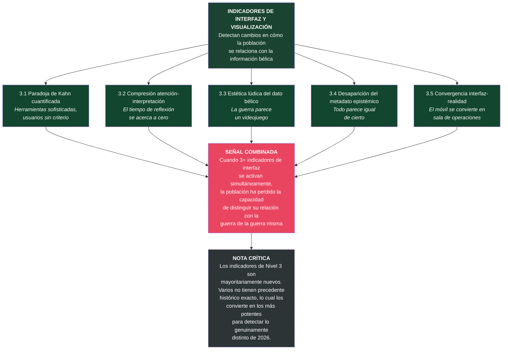

# Nivel 3: Indicadores de Interfaz y Visualización

Los indicadores de interfaz detectan **cambios en cómo la población se relaciona con la información sobre el conflicto**. Son los más visibles, los más recientes y, en muchos casos, los más difíciles de encontrar en corpus históricos anteriores al siglo XXI. Varios de ellos son genuinamente nuevos — fenómenos sin precedente exacto — lo cual los convierte en los más potentes para detectar lo que es específicamente distinto de 2026.

---

## 3.1: Paradoja de Kahn cuantificada

**Definición precisa:** Brecha medible entre la sofisticación de las herramientas de visualización de inteligencia disponibles para el público general y la competencia analítica real de quienes las utilizan. El indicador se activa cuando el acceso a herramientas supera significativamente la capacidad de interpretación, generando sobreconfianza epistémica masiva.

**Mecanismo cognitivo que detecta:** La ilusión de competencia generada por la interfaz. Cuando una herramienta presenta datos complejos de forma visualmente comprensible, el usuario confunde "puedo ver el dato" con "puedo interpretar el dato". La interfaz democratiza el acceso pero no el criterio. El resultado es una forma nueva de vulnerabilidad: millones de personas que creen tener criterio sobre escalada nuclear, movimientos de flota o capacidades misiles porque pueden ver un punto moverse en un mapa.

**Marcadores lingüísticos/discursivos observables:**
- Usuarios de redes sociales usando vocabulario técnico de inteligencia (SIGINT, ELINT, IMINT) sin formación.
- Hilos de análisis amateur que presentan datos de FlightRadar24 o MarineTraffic como "inteligencia de señales".
- Capturas de pantalla de dashboards compartidas como "prueba" de eventos no verificados.
- Ausencia de expresiones de incertidumbre ("podría ser", "no es seguro") en análisis amateur — certeza como posición por defecto.
- Crecimiento exponencial de cuentas que se presentan como "analistas OSINT" sin credenciales verificables.

**Ejemplos históricos posibles:**
- **Radioaficionados en la Guerra Fría (1950s-60s):** Podían interceptar comunicaciones militares pero carecían del marco interpretativo para entender lo que oían. La diferencia: eran pocos, sabían que no sabían, y no tenían plataformas de distribución masiva.
- **Mapas de guerra en periódicos (WWI-WWII):** El público podía "seguir" el frente en mapas impresos, pero la mediación editorial contextualizaba los datos y nadie confundía seguir un mapa con hacer análisis militar.
- **Irán 2026:** Millones de personas rastrean transponders, zonas de exclusión aérea, imágenes satelitales y alertas en tiempo real. Muchos creen estar haciendo inteligencia. La brecha entre herramienta y competencia es máxima y la conciencia de esa brecha es mínima.

**Riesgos de falso positivo:**
- Analistas OSINT legítimos con formación real que usan las mismas herramientas con rigor metodológico.
- Comunidades técnicas especializadas (aviación, náutica) que sí tienen competencia para interpretar FlightRadar24 o MarineTraffic en su dominio.

**Utilidad metodológica:**
- *Historia intelectual:* Permite estudiar la evolución de la relación entre acceso a información y competencia analítica — una relación que la democratización digital ha invertido.
- *Geopolítica:* Indicador de vulnerabilidad cognitiva masiva: una población que cree entender la escalada es más fácil de manipular que una que reconoce su ignorancia.
- *Análisis OSINT:* Cuantificable mediante análisis de redes: ratio entre cuentas que comparten datos de dashboards y cuentas con credenciales verificables; frecuencia de vocabulario técnico mal utilizado.

---

## 3.2: Compresión del ciclo atención-interpretación

**Definición precisa:** Reducción del intervalo temporal entre la recepción de un dato y su "interpretación" por parte del usuario hasta un punto en que la interpretación se convierte en reacción automática, no en proceso reflexivo. El indicador se activa cuando el tiempo entre ver un dato bélico y emitir un juicio sobre él se acerca a cero.

**Mecanismo cognitivo que detecta:** La interpretación genuina requiere tiempo: contrastar, contextualizar, dudar, reformular. Cuando la interfaz presenta datos en flujo continuo y el ecosistema social recompensa la velocidad de reacción (primer comentario, primer análisis, primer hilo), el proceso interpretativo se comprime hasta desaparecer. Lo que queda no es interpretación: es reflejo condicionado por la interfaz.

**Marcadores lingüísticos/discursivos observables:**
- Hilos de "análisis" publicados minutos después de un evento, sin tiempo material para verificación.
- Comentarios que reformulan el dato sin añadir contexto ("Impacto confirmado" como "análisis").
- Ciclos de viralidad que se disparan antes de que el evento esté verificado.
- Correcciones posteriores que obtienen una fracción de la difusión del dato original.
- Interfaz de redes que premia velocidad de publicación (algoritmo de recencia).

**Ejemplos históricos posibles:**
- **Telégrafo y prensa en el s. XIX:** El telégrafo comprimió el ciclo de días a horas. Los periódicos empezaron a publicar "extras" con noticias sin verificar. Pero el formato impreso obligaba a un mínimo de edición.
- **CNN effect (1991):** La televisión 24 horas comprimió el ciclo a minutos para la audiencia y para los decisores políticos. Pero el formato televisivo aún imponía una mediación (presentador, corresponsal).
- **Irán 2026:** El ciclo atención-interpretación se ha comprimido a segundos. El usuario ve un punto rojo en un mapa y publica su "interpretación" antes de que ningún medio haya verificado el evento. No hay mediación temporal ni editorial entre el dato y la reacción.

**Riesgos de falso positivo:**
- Profesionales con formación que pueden hacer evaluaciones rápidas legítimas basadas en experiencia acumulada (un analista veterano puede interpretar rápido porque tiene décadas de contexto).
- Breaking news legítimo donde la velocidad informativa sirve a la seguridad pública (alertas de ataques, evacuaciones).

**Utilidad metodológica:**
- *Historia intelectual:* Permite rastrear la compresión temporal de la deliberación pública a lo largo de siglos — una variable que correlaciona con la calidad del juicio colectivo.
- *Geopolítica:* Señal de que el "fog of war" se ha trasladado del campo de batalla al espacio informativo: la incertidumbre ya no está en los datos sino en la interpretación apresurada.
- *Análisis OSINT:* Cuantificable midiendo el desfase temporal entre un evento (según fuentes verificadas) y las primeras publicaciones amateur que lo "analizan".

---

## 3.3: Estética lúdica del dato bélico

**Definición precisa:** Adopción de convenciones visuales, narrativas y estéticas propias de los videojuegos en la presentación de datos bélicos reales, de modo que la guerra se consume con la gramática visual del juego. El indicador se activa cuando las visualizaciones de datos de guerra son indistinguibles formalmente de interfaces de juegos estratégicos.

**Mecanismo cognitivo que detecta:** La estética no es neutra: estructura la recepción. Cuando los datos de guerra se presentan con leaderboards, marcadores, códigos de color competitivos, efectos de sonido o animaciones que evocan juegos, el marco perceptivo del espectador se desplaza del "esto es una tragedia" al "esto es una partida". La estética lúdica activa circuitos cognitivos de entretenimiento, no de empatía o juicio moral.

**Marcadores lingüísticos/discursivos observables:**
- Paneles de guerra con contadores de impactos, porcentajes de destrucción o rankings de eficacia.
- Uso de códigos de color rojo/verde que evocan "game over" / "victoria" en lugar de destrucción / supervivencia.
- Mapas interactivos con animaciones de trayectorias de misiles que recuerdan a interfaces de juegos RTS (Real-Time Strategy).
- Vocabulario de gaming aplicado a datos reales: "kill count", "damage dealt", "area denied".
- Soundbites de videojuegos ("Flawless Victory") usados en comunicación oficial.

**Ejemplos históricos posibles:**
- **"Gun camera" footage en WWII:** Las primeras filmaciones desde cámaras de aviones de combate ya tenían una cualidad proto-lúdica — el espectador veía la destrucción desde la perspectiva del "jugador". Pero el formato era cine, no interactivo.
- **"Bomba inteligente" en la Guerra del Golfo (1991):** Las imágenes de misiles guiados por láser impactando en objetivos fueron las primeras visualizaciones bélicas que parecían un videojuego. El Pentágono lo promovió deliberadamente.
- **Irán 2026:** Los paneles de IA interactivos presentan datos de guerra con estética que replica interfaces de juegos como *Command & Conquer* o *DEFCON*. Los usuarios interactúan con ellos con la misma gramática con la que interactúan con un juego. La convergencia estética es total.

**Riesgos de falso positivo:**
- Visualización de datos legítima que usa principios de diseño compartidos con juegos (códigos de color, interactividad) por razones de usabilidad, no de gamificación.
- Simulaciones militares profesionales que siempre han usado interfaces similares a juegos (de hecho, la influencia histórica va en ambas direcciones).

**Utilidad metodológica:**
- *Historia intelectual:* Permite rastrear la evolución de la relación entre representación de la violencia y su recepción — desde el retablo medieval al cine bélico al dashboard interactivo.
- *Geopolítica:* Indicador de que la resistencia emocional de la población a la violencia estatal se ha debilitado por la familiaridad estética: si la guerra parece un juego, se acepta como se acepta un juego.
- *Análisis OSINT:* Detectable mediante análisis formal de las interfaces de los paneles más compartidos: qué convenciones visuales usan, de qué dominio proceden, qué marco perceptivo activan.

---

## 3.4: Desaparición del metadato epistémico

**Definición precisa:** Eliminación progresiva en las visualizaciones de datos bélicos de los indicadores de procedencia, nivel de confianza, margen de error, fecha de actualización y grado de verificación, de modo que todos los datos se presentan con igual apariencia de certeza. El indicador se activa cuando la interfaz no permite al usuario distinguir entre dato verificado, estimación, rumor y desinformación.

**Mecanismo cognitivo que detecta:** El metadato epistémico — de dónde viene este dato, cuánto confiamos en él, cuándo fue actualizado, quién lo verificó — es lo que permite al analista profesional distinguir señal de ruido. Cuando la interfaz elimina estos metadatos y presenta todo como dato igualmente cierto, el usuario pierde la capacidad de calibrar su propia certeza. Todo parece igual de fiable. Todo parece igual de real.

**Marcadores lingüísticos/discursivos observables:**
- Paneles que presentan datos de satélite, rumores de Telegram, declaraciones oficiales e inferencias algorítmicas con el mismo formato visual.
- Ausencia de indicadores de confianza ("verificado", "sin confirmar", "fuente única").
- Timestamps vagos o ausentes en datos que se presentan como "en tiempo real".
- Desaparición de las notas de fuente ("según...", "fuentes no confirmadas indican...").
- Imágenes satelitales presentadas sin fecha, resolución ni contexto de adquisición.

**Ejemplos históricos posibles:**
- **Propaganda gráfica en WWI:** Los mapas de guerra publicados en periódicos omitían deliberadamente la incertidumbre — las líneas del frente se dibujaban como si fueran precisas, cuando en realidad eran aproximaciones. Pero el público asumía imprecisión porque el medio (papel impreso) la sugería.
- **Armas de destrucción masiva en Irak (2003):** La presentación de Powell ante el Consejo de Seguridad usó imágenes satelitales y gráficos que presentaban inferencias como certezas. Pero era un evento único, no un flujo continuo.
- **Irán 2026:** Los paneles de IA presentan flujo continuo de datos heterogéneos (satélite, radar, redes sociales, fuentes oficiales, inferencias algorítmicas) con el mismo formato visual y sin ningún indicador de procedencia o fiabilidad. El usuario no tiene forma de distinguir un dato verificado de una inferencia no confirmada.

**Riesgos de falso positivo:**
- Simplificación legítima para audiencias no técnicas donde el exceso de metadatos dificulta la comprensión.
- Formatos periodísticos que usan "fuentes dicen" o "según informes" como metadato implícito de incertidumbre.

**Utilidad metodológica:**
- *Historia intelectual:* Permite estudiar cómo cambia la relación entre dato y certeza a lo largo de la historia — un fenómeno que afecta directamente a la calidad del juicio público.
- *Geopolítica:* Indicador de que el ecosistema informativo ha perdido su capacidad de auto-calibración: sin metadato epistémico, no hay forma de saber cuánto confiar en lo que se ve.
- *Análisis OSINT:* Directamente auditable: evaluar los paneles más populares y documentar qué metadatos epistémicos incluyen y cuáles omiten.

---

## 3.5: Convergencia interfaz-realidad

**Definición precisa:** Reducción de la distancia perceptiva entre la interfaz a través de la cual se consume la guerra y la interfaz a través de la cual se conduce, de modo que el observador civil y el operador militar usan herramientas formalmente similares. El indicador se activa cuando "cualquier móvil u ordenador conectado a internet puede convertirse en una sala de operaciones del Pentágono", como describe el artículo de El Mundo.

**Mecanismo cognitivo que detecta:** Cuando la interfaz del espectador se parece a la interfaz del operador, el espectador se percibe a sí mismo como participante, no como observador. Esa ilusión de agencia — la sensación de estar "en la sala de operaciones" — elimina la distancia cognitiva que históricamente separaba al civil del combatiente. No es que el civil se convierta en combatiente: es que deja de sentirse como civil.

**Marcadores lingüísticos/discursivos observables:**
- Paneles públicos que replican conscientemente la estética de centros de mando militar (mapas tácticos, alertas codificadas, terminología operativa).
- Usuarios que describen su actividad como "monitorizar", "rastrear", "seguir operaciones" — vocabulario operativo, no de consumo.
- Desaparición de la autoidentificación como "espectador" o "lector" — sustituida por "analista", "tracker", "monitor".
- Hardware de consumo (móviles, tablets) presentado como equivalente funcional de hardware militar.
- Experiencia de usuario diseñada para producir inmersión operativa (alertas push, sonidos de alerta, actualizaciones que exigen atención continua).

**Ejemplos históricos posibles:**
- **Radio en WWII:** Los ciudadanos podían escuchar transmisiones de guerra, pero la radio no replicaba la experiencia del centro de operaciones. El medio mantenía la distancia.
- **Televisión en Vietnam:** La TV llevó la guerra al salón, pero como espectáculo pasivo. El espectador no tenía la ilusión de participar en las operaciones.
- **Irán 2026:** Los paneles de IA interactivos producen una experiencia inmersiva que replica formalmente la estética de un centro de mando. "Cualquier móvil se convierte en una sala de operaciones". La convergencia interfaz-realidad es la condición de posibilidad de todos los demás indicadores de este nivel.

**Riesgos de falso positivo:**
- Simulaciones educativas o de entrenamiento que replican interfaces militares con fines formativos legítimos.
- Juegos de estrategia militar que siempre han existido sin producir confusión ontológica (el jugador de *Risk* sabe que no está dirigiendo un ejército).

**Utilidad metodológica:**
- *Historia intelectual:* Permite rastrear la evolución de la distancia perceptiva entre civil y combatiente — una distancia que define la experiencia de la guerra en cada época.
- *Geopolítica:* Indicador de que la frontera entre combatiente y civil se está difuminando en el plano cognitivo, lo cual tiene implicaciones para la movilización, la legitimación de la violencia y la responsabilidad democrática.
- *Análisis OSINT:* Detectable mediante análisis de diseño de interfaces: documentar qué convenciones de centros de mando militar replican los paneles públicos más populares.

---

## Síntesis del Nivel 3

