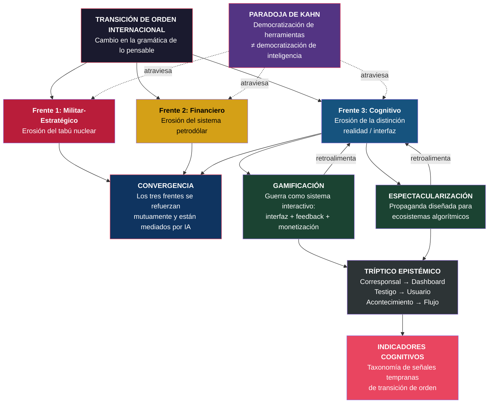

# Mapa Conceptual Maestro — Proyecto Lattix

## Contexto

Este diagrama representa la arquitectura analítica completa del proyecto. No es un mapa del conflicto: es un mapa de **cómo pensamos el conflicto** y qué estructuras cognitivas están en juego.

## Diagrama principal

## Cómo leer este mapa

**Estructura vertical**: de arriba (la tesis general) hacia abajo (las herramientas analíticas concretas).

**Los tres frentes** (rojo, amarillo, azul) operan simultáneamente. La novedad no es que exista erosión en uno de ellos — es que los tres convergen al mismo tiempo y se refuerzan mutuamente.

**La Paradoja de Kahn** (violeta) es transversal: afecta a los tres frentes. En cada uno de ellos, la democratización de herramientas genera ilusión de comprensión sin comprensión real.

**Gamificación y espectacularización** (verde) son bucles de retroalimentación que agravan el frente cognitivo. No son consecuencias pasivas del conflicto: son mecanismos activos que modifican cómo se percibe y se procesa la guerra.

**El tríptico epistémico** resume la transformación en la estructura de la experiencia: quién informa (corresponsal → dashboard), quién observa (testigo → usuario), qué se observa (acontecimiento → flujo).

**Los indicadores cognitivos** (rojo inferior) son la contribución operativa: herramientas para detectar cuándo cambia la gramática de lo pensable *antes* de que cambie formalmente el sistema.

## Tesis central

> La novedad no es solo que la guerra sea retransmitida en tiempo real, sino que sea experimentada como sistema interactivo de observación, especulación y participación simbólica. Eso constituye un indicador de cambio de época.
