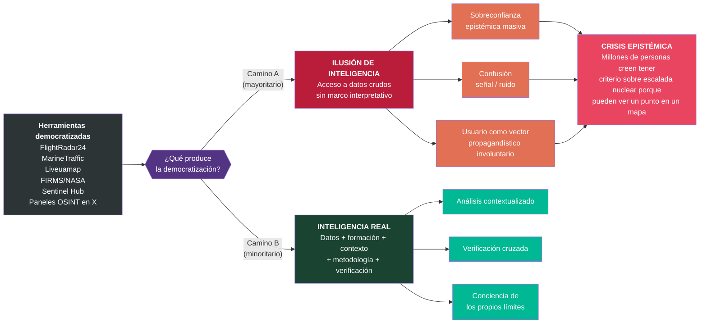
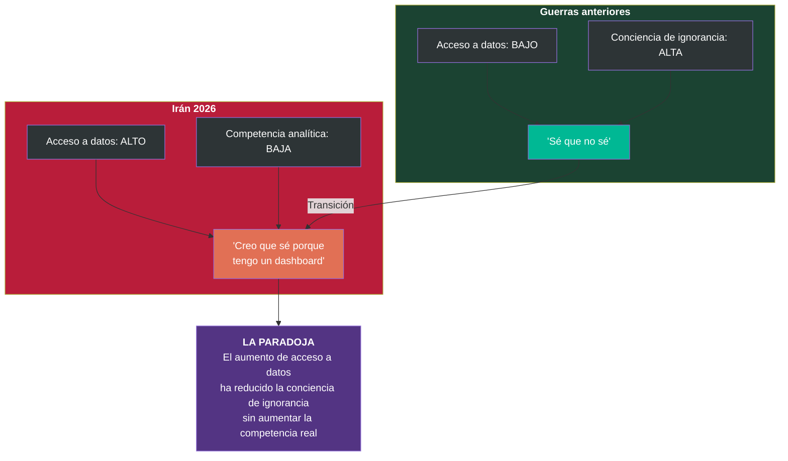

# La Paradoja de Kahn

## Contexto

Herman Kahn fue el primer pensador estratégico en forzar a la sociedad a *pensar lo impensable* sobre la guerra nuclear. La paradoja que lleva su nombre en este proyecto describe un fenómeno contemporáneo análogo: **la democratización de las herramientas de visualización de inteligencia no democratiza la inteligencia — democratiza la ilusión de inteligencia**.

## Diagrama: bifurcación epistémica

## Diagrama: asimetría herramienta-competencia

## Notas interpretativas

**La sobreconfianza epistémica de masas es un fenómeno nuevo.** En guerras anteriores, la población general sabía que no tenía acceso a información militar relevante. Existía una asimetría reconocida entre lo que sabía el ciudadano y lo que sabía el analista. Esa asimetría generaba, paradójicamente, un efecto protector: la humildad epistémica.

En 2026, la asimetría de competencia sigue existiendo — un analista SIGINT del CNI o del Centro Criptológico Nacional sigue teniendo capacidades radicalmente superiores a cualquier usuario de X —, pero la asimetría *percibida* ha desaparecido. El usuario que rastrea transponders en FlightRadar24 cree estar haciendo inteligencia de señales. No lo está haciendo.

**El que interactúa cree que está construyendo su propia información. No es consciente de que está siendo utilizado como vector propagandístico.**

> La democratización de las herramientas sin la democratización del criterio produce una forma nueva de vulnerabilidad: la sobreconfianza epistémica masiva.
