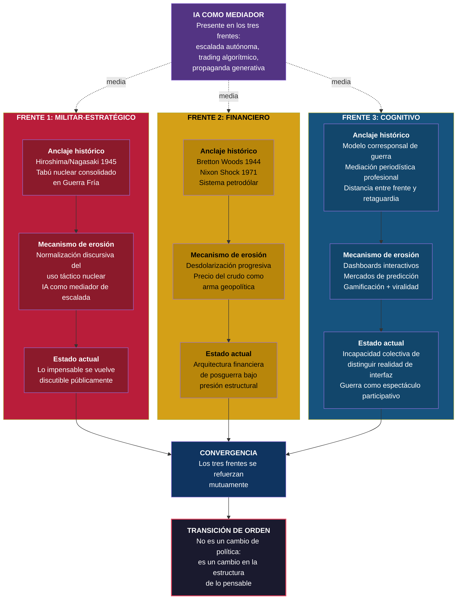
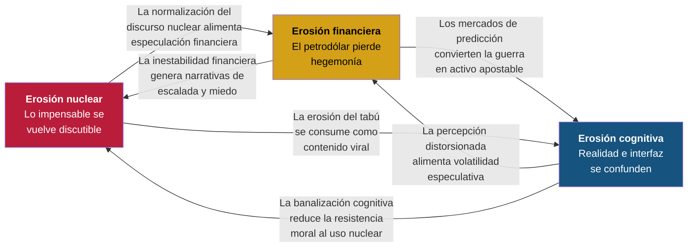

# Los Tres Frentes de Erosión Simultánea

## Contexto

La tesis central del proyecto Lattix no es que *un* pilar del orden internacional esté erosionándose — eso ha ocurrido antes. Lo nuevo es que **tres pilares fundamentales se erosionan simultáneamente**, se refuerzan mutuamente y están mediados por inteligencia artificial.

## Diagrama: tres frentes paralelos con convergencia

## Diagrama: refuerzo mutuo entre frentes

## Notas interpretativas

**La simultaneidad es la clave.** El tabú nuclear se erosionó parcialmente durante la Guerra Fría sin provocar un cambio de orden (la disuasión se mantuvo). El sistema financiero sufrió crisis severas (1973, 2008) sin colapsar el marco general. La mediación informativa cambió con la televisión (Vietnam) y con internet (Irak 2003) sin alterar radicalmente la estructura epistémica.

Lo que ocurre en 2026 es distinto: **los tres frentes se erosionan al mismo tiempo, se retroalimentan y están mediados por la misma tecnología (IA)**. Eso genera una presión sistémica que no tiene precedente exacto, aunque tiene analogías parciales con el período de entreguerras (1918-1939).

> Cuando la erosión afecta simultáneamente al pilar estratégico, al financiero y al cognitivo, no estamos ante una crisis sectorial. Estamos ante una transición de orden.
