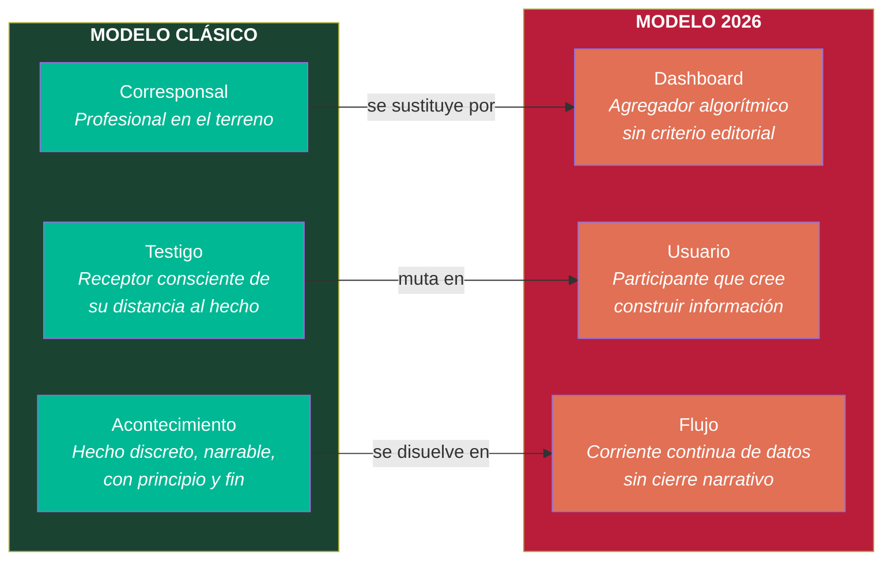
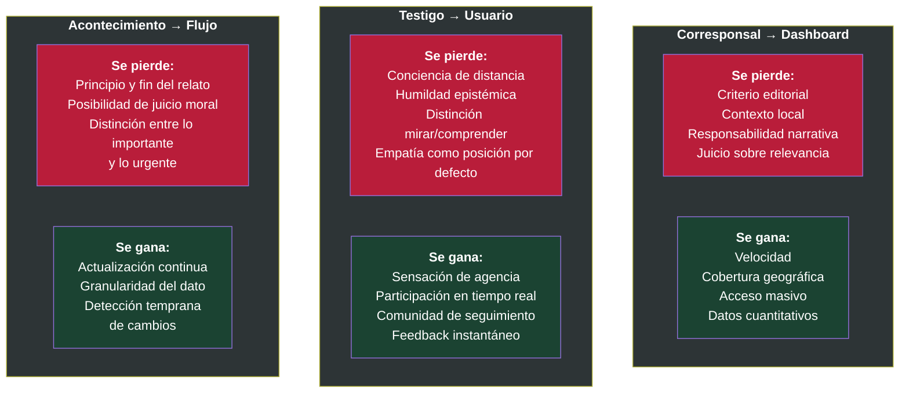
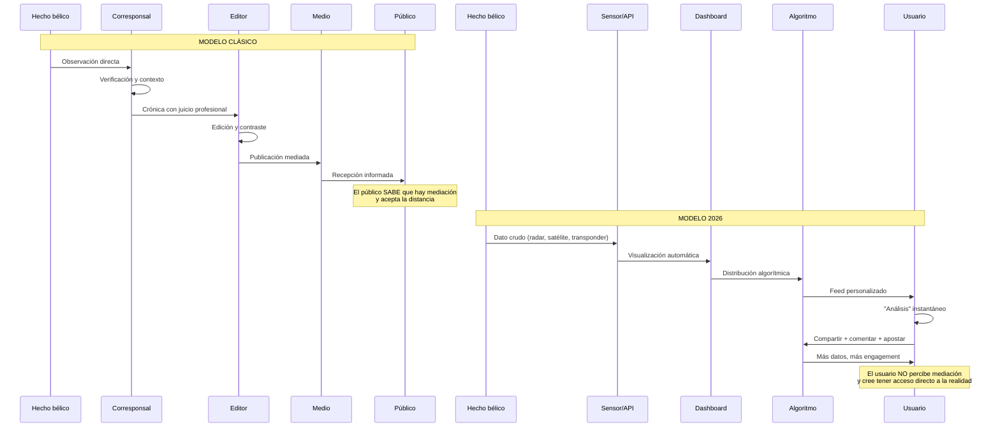

# El Tríptico Epistémico: Del Corresponsal al Dashboard

## Contexto

La transformación más profunda del conflicto Irán 2026 no es tecnológica — es epistémica. Ha cambiado **quién informa**, **quién observa** y **qué se observa**. Este tríptico captura las tres mutaciones simultáneas.

## Diagrama: las tres transiciones

## Diagrama: qué se pierde y qué se gana en cada transición

## Diagrama: flujo de información comparado

## Notas interpretativas

**La transición no es simplemente tecnológica.** No se trata de que haya mejores herramientas. Se trata de que ha cambiado la **estructura de la experiencia de la guerra**.

El corresponsal no solo transmitía datos — **filtraba, contextualizaba y asumía responsabilidad**. El dashboard no filtra: agrega. No contextualiza: visualiza. No asume responsabilidad: distribuye.

El testigo clásico sabía que estaba lejos. **Su distancia era una condición epistémica reconocida**. El usuario de 2026 está igual de lejos, pero la interfaz le produce una ilusión de proximidad que elimina la conciencia de distancia.

El acontecimiento tenía estructura narrativa: principio, desarrollo, desenlace. **El flujo no tiene desenlace**. Nunca termina. Y cuando la información no termina, el juicio moral no encuentra dónde apoyarse.

> Cuando la guerra se vuelve legible como videojuego, el juicio moral pierde terreno frente a la excitación informativa.
