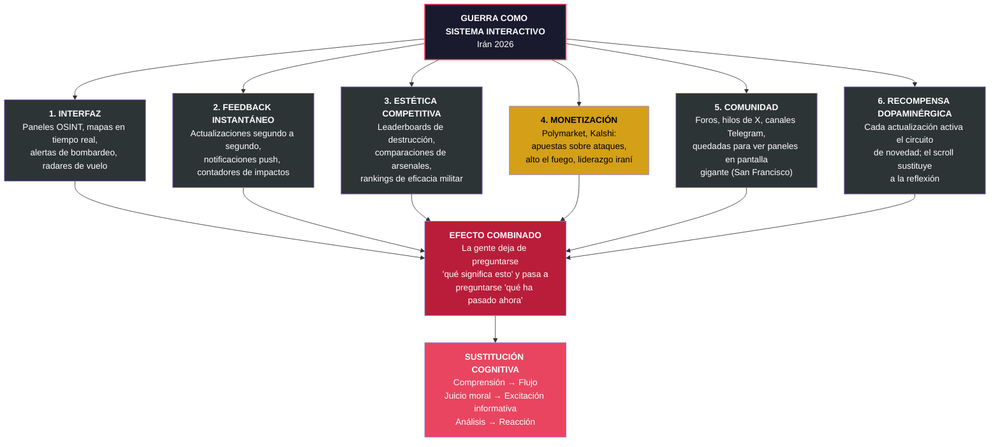
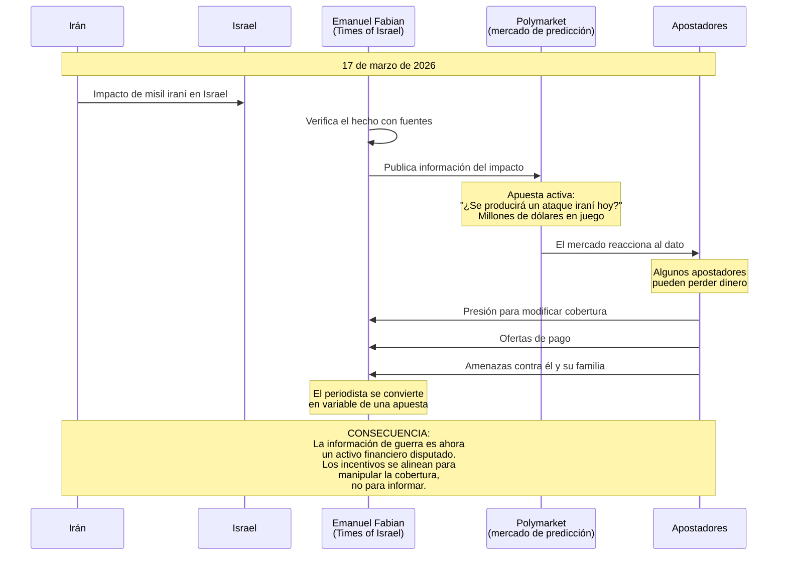
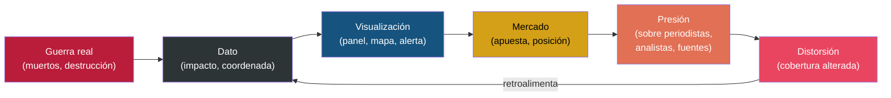

# La Gamificación de la Guerra

## Contexto

El conflicto Irán 2026 no solo se retransmite en tiempo real — se **experimenta como sistema interactivo**. La guerra ha adquirido los seis elementos definitorios de un sistema gamificado: interfaz, feedback instantáneo, estética competitiva, monetización, comunidad y recompensa dopaminérgica. Esto no es una metáfora: es una descripción estructural.

## Diagrama: los seis elementos de la guerra gamificada

## Caso Fabian/Polymarket: cuando la gamificación retroalimenta la desinformación

## Diagrama: la cadena de retroalimentación

## Notas interpretativas

**No es solo que la guerra se gamifique. Es que la gamificación retroalimenta la desinformación.** El caso Fabian demuestra empíricamente lo que la teoría sugiere: cuando hay dinero real en juego, los incentivos se alinean para manipular la cobertura, no para informar.

La propuesta de organizar una quedada en San Francisco para ver paneles de guerra en pantalla gigante resume el momento social y tecnológico. El conflicto no se consume como noticia: se observa como un flujo continuo de datos que se visualizan, se comentan y se monetizan.

**El efecto cognitivo central**: la sustitución de comprensión por flujo. La gente deja de preguntarse *qué significa esto* y pasa a preguntarse *qué ha pasado ahora*. El ciclo de novedad reemplaza al ciclo de sentido.

> Cuando la guerra entra en mercados de apuestas, el hecho deja de ser solo hecho y se convierte en activo disputado.
