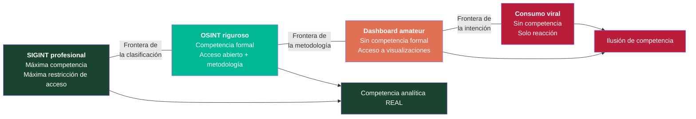
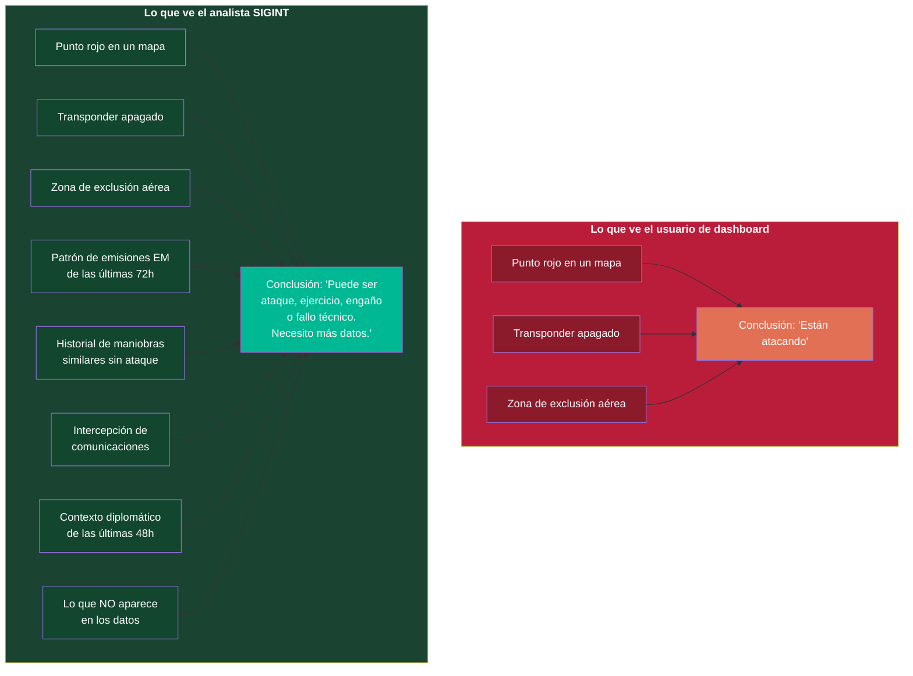

# SIGINT vs OSINT: Honestidad Epistémica

## Contexto

Una de las confusiones más peligrosas del ecosistema informativo de 2026 es la equiparación entre **consumir datos visualizados** y **hacer análisis de inteligencia**. Este documento establece las distinciones que la honestidad metodológica exige.

## Tabla comparativa: cuatro niveles de relación con los datos

| Dimensión | SIGINT profesional | OSINT riguroso | "SIGINT" de dashboard | OSINT de consumo |
|-----------|-------------------|----------------|----------------------|------------------|
| **Formación requerida** | Años de formación especializada (CNI, CCN, NSA, GCHQ) | Máster o formación acreditada en análisis de inteligencia | Ninguna formal | Ninguna |
| **Acceso a fuentes** | Señales clasificadas, intercepción electromagnética, sistemas propios | Fuentes abiertas verificadas, bases de datos públicas, registros oficiales | Paneles públicos (FlightRadar24, MarineTraffic, FIRMS) | Hilos de X, capturas de pantalla, clips virales |
| **Método analítico** | Protocolos de verificación cruzada, análisis de patrones, ciclo de inteligencia completo | Metodología OSINT formal, triangulación, jerarquía de fuentes | Observación de interfaz, correlación visual ad hoc | Reacción emocional al dato |
| **Interpretación del silencio** | Lo que *no aparece* en los datos es tan significativo como lo que aparece | Se documenta lo no verificable como laguna | No se contempla | No se contempla |
| **Verificación** | Cruzada con múltiples fuentes clasificadas, cadena de custodia | Cruzada con fuentes abiertas independientes | Ninguna sistemática | Ninguna |
| **Marco institucional** | Agencia de inteligencia con supervisión, protocolos y rendición de cuentas | Organización de investigación o medio con estándares editoriales | Ninguno | Ninguno |
| **Conciencia de límites** | Alta: sabe lo que sabe y lo que no sabe | Alta: opera dentro de límites declarados | Baja: confunde acceso con competencia | Muy baja: confunde consumo con análisis |
| **Riesgo epistémico** | Sesgos institucionales, compartimentación | Sesgos de disponibilidad, limitación de fuentes | **Sobreconfianza masiva**: cree hacer inteligencia | **Vector propagandístico**: amplifica sin criterio |
| **Ejemplo concreto** | Analista del CCN interpretando emisiones electromagnéticas iraníes | Investigador OSINT documentando movimientos de flota con MarineTraffic + verificación cruzada | Usuario de X comentando transponders apagados como si fuera "análisis SIGINT" | Persona compartiendo captura de FlightRadar con comentario "esto es grave" |

## Diagrama: espectro de competencia analítica

## Diagrama: lo que ve el usuario vs lo que ve el analista

## Notas interpretativas

**La diferencia no es solo de grado — es de naturaleza.** Un analista SIGINT y un usuario de FlightRadar24 no están haciendo lo mismo a distintos niveles de calidad. Están haciendo cosas fundamentalmente diferentes. El primero interpreta señales dentro de un marco contextual, institucional y metodológico. El segundo observa una representación visual de datos crudos.

**La humildad epistémica es una posición metodológica, no una debilidad.** Reconocer que una investigadora con máster en análisis de inteligencia puede usar herramientas OSINT pero no pretende hacer análisis SIGINT no es una limitación: es la base de la credibilidad. La falta de respeto hacia los analistas profesionales comienza exactamente cuando alguien confunde una captura de pantalla con inteligencia procesada.

> Un analista real SIGINT ha pasado años formándose. Confundir consumir mapas e informaciones de inteligencia con saber interpretar la inteligencia no es lo mismo. Pretender lo contrario es una falta de respeto y de honestidad hacia los analistas que sí trabajan en eso.
