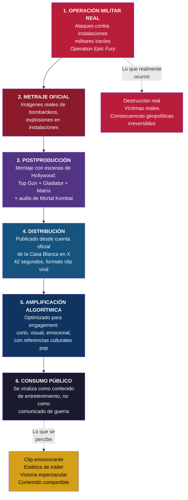
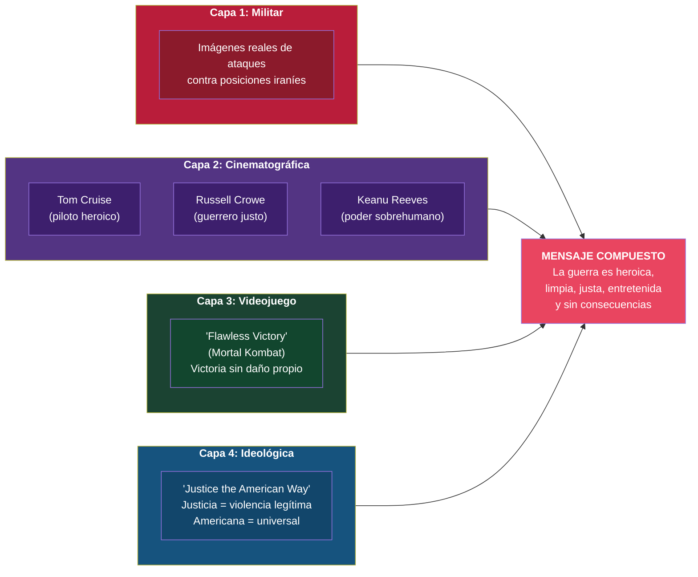

# Pipeline de Espectacularización

## Contexto

El 6 de marzo de 2026, la cuenta oficial de la Casa Blanca publicó en X un vídeo de 42 segundos titulado *"Justice the American Way"* para promocionar la operación *Epic Fury* contra Irán. El vídeo mezclaba escenas de Tom Cruise pilotando un caza, Russell Crowe en combate gladiador y Keanu Reeves disparando en modo Matrix, intercaladas con imágenes reales de ataques contra posiciones iraníes. Terminaba con una voz en off: *"Flawless Victory"*, extraída de Mortal Kombat.

Eso ya no es comunicación de guerra clásica. Es **propaganda diseñada para ecosistemas algorítmicos de entretenimiento**.

## Diagrama: pipeline de transformación

## Diagrama: capas semióticas del vídeo "Justice the American Way"

## Diagrama: comparativa histórica de propaganda bélica

| Conflicto | Medio dominante | Registro comunicativo | Velocidad | Dirección |
|-----------|----------------|----------------------|-----------|-----------|
| WWI | Carteles, prensa | Apelación patriótica directa | Días/semanas | Estado → ciudadano |
| WWII | Radio, cine | Narrativa heroica estructurada | Horas/días | Estado → ciudadano |
| Vietnam | Televisión | Realismo visual (no controlado) | Horas | Terreno → salón |
| Guerra del Golfo (1991) | CNN 24h | "Guerra limpia" tecnológica | Minutos | Pentágono → cadena → público |
| Irak (2003) | Internet + TV | Embedded journalism + blogs | Minutos | Múltiple, parcialmente descontrolada |
| **Irán (2026)** | **Redes + IA + dashboards** | **Gamificación + entretenimiento** | **Segundos** | **Multidireccional, algorítmica** |

## Notas interpretativas

**La elección de "Flawless Victory" no es casual.** En Mortal Kombat, *Flawless Victory* significa que has ganado sin recibir un solo golpe. Aplicado a una operación militar real, el mensaje es: victoria total, sin coste, sin dolor, sin consecuencias. Es la negación semiótica de la tragedia.

**El formato de 42 segundos tampoco es casual.** Está diseñado para el consumo algorítmico: lo suficientemente corto para que X lo reproduzca en bucle, lo suficientemente visual para generar engagement, lo suficientemente emocional para provocar compartición.

**La espectacularización no es un efecto secundario.** Es una estrategia deliberada de comunicación política adaptada a ecosistemas donde la atención se captura con gramática de entretenimiento, no de información.

> Cuando los bombardeos se presentan con la estética de un clip viral o de un tráiler de acción, el conflicto corre el riesgo de percibirse más como espectáculo que como tragedia humana.
