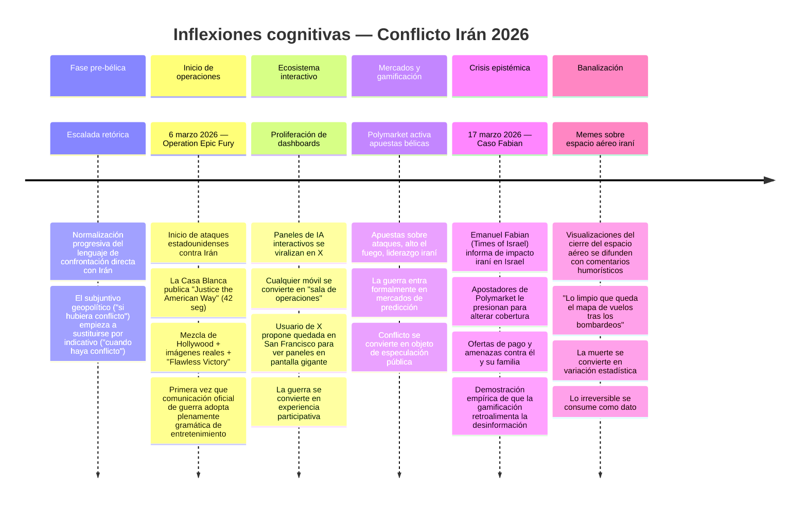
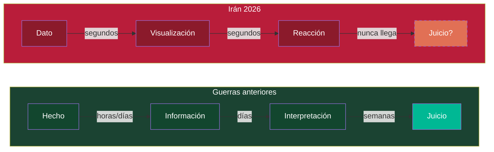

# Línea Temporal: Inflexiones Cognitivas del Conflicto Irán 2026

## Contexto

Esta no es una cronología militar. Es una **cronología cognitiva**: los momentos en que cambió cómo se percibe, se procesa y se consume el conflicto. No los bombardeos, sino los puntos donde la gramática de lo pensable se desplazó.

## Línea temporal

## Diagrama: aceleración del ciclo cognitivo

## Notas interpretativas

**Lo que esta cronología muestra no es una secuencia de eventos militares, sino la velocidad a la que se erosionaron las estructuras de mediación.** En semanas, el conflicto pasó de ser un acontecimiento cubierto por corresponsales a ser un sistema interactivo consumido como entretenimiento.

**La aceleración del ciclo cognitivo es el dato central.** En guerras anteriores, entre el hecho y el juicio moral pasaban días o semanas. Ese tiempo permitía la reflexión, la contextualización y la deliberación. En 2026, la visualización es casi instantánea y la reacción sustituye a la interpretación. El juicio moral no desaparece: simplemente no encuentra tiempo ni espacio donde formarse.

> La compresión temporal no es solo velocidad. Es la eliminación del espacio donde el juicio moral puede formarse.
